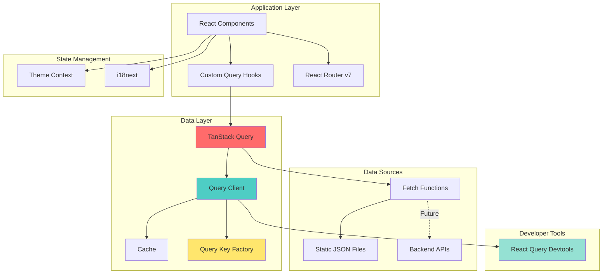
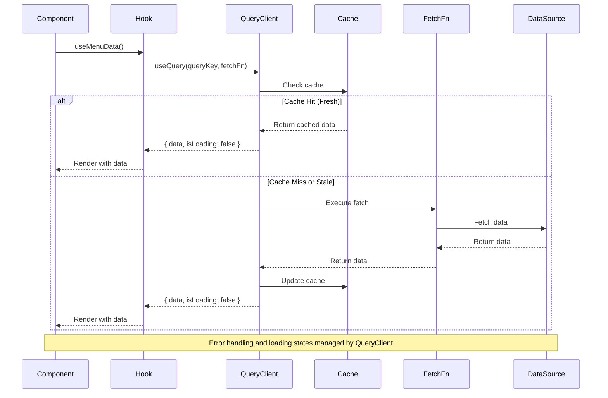
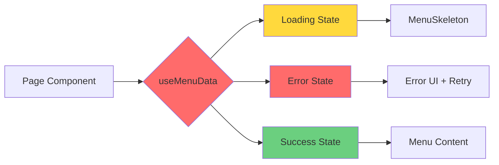

# TanStack Query v5+ Modernization - Technical Design

**Feature Name:** tanstack-query-modernization  
**Project:** Starbucks Egypt React Application  
**Status:** Design Phase  
**Last Updated:** 2024

---

## Overview

This design document specifies the technical architecture for modernizing the Starbucks Egypt React application's data layer by migrating from static JSON file imports to TanStack Query v5+. The modernization establishes a production-grade data fetching and caching solution that maintains 100% UI/UX parity while enabling future backend API integration.

### Design Goals

1. **Zero Breaking Changes**: Maintain identical UI/UX, RTL/LTR support, dark mode, animations, and accessibility
2. **Type-Safe Architecture**: Leverage TypeScript strict mode for compile-time safety
3. **Intelligent Caching**: Implement optimized cache strategies to reduce network requests
4. **Developer Experience**: Provide clear patterns, utilities, and debugging tools
5. **Progressive Migration**: Enable incremental adoption without requiring complete rewrite
6. **Future-Ready**: Design for seamless backend API integration

### Key Design Principles

- **Separation of Concerns**: Data fetching logic isolated from UI components
- **Single Source of Truth**: Centralized query key management
- **Fail-Safe Defaults**: Graceful degradation and error recovery
- **Performance First**: Optimized caching and minimal re-renders
- **Accessibility**: Enhanced loading/error state announcements

---

## Architecture

### High-Level Architecture Diagram



### Data Flow Diagram



### Component Integration Pattern



---

## Components and Interfaces

### 1. Query Client Configuration

**File**: `src/lib/queryClient.ts`

```typescript
import { QueryClient } from "@tanstack/react-query";

/**
 * Global QueryClient configuration
 * Optimized for production use with intelligent caching and retry logic
 */
export const queryClient = new QueryClient({
  defaultOptions: {
    queries: {
      // Cache Configuration
      staleTime: 5 * 60 * 1000, // 5 minutes - data considered fresh
      gcTime: 10 * 60 * 1000, // 10 minutes - cache garbage collection (formerly cacheTime)

      // Retry Configuration
      retry: 3, // Retry failed requests 3 times
      retryDelay: (attemptIndex) => Math.min(1000 * 2 ** attemptIndex, 30000), // Exponential backoff

      // Refetch Configuration
      refetchOnWindowFocus: false, // Don't refetch on window focus (static data)
      refetchOnReconnect: true, // Refetch when network reconnects
      refetchOnMount: false, // Don't refetch on component mount if data is fresh

      // Error Handling
      throwOnError: false, // Don't throw errors, handle them in components
    },
    mutations: {
      retry: 1, // Retry mutations once
      throwOnError: false,
    },
  },
});

/**
 * Type-safe query client instance
 * Use this instead of creating new QueryClient instances
 */
export type AppQueryClient = typeof queryClient;
```

**Integration in App.tsx**:

```typescript
import { QueryClientProvider } from '@tanstack/react-query';
import { ReactQueryDevtools } from '@tanstack/react-query-devtools';
import { queryClient } from '@/lib/queryClient';

function App() {
  return (
    <QueryClientProvider client={queryClient}>
      <Router>
        {/* Existing app structure */}
      </Router>

      {/* Devtools - only in development */}
      {import.meta.env.DEV && (
        <ReactQueryDevtools
          initialIsOpen={false}
          position="bottom-right"
          buttonPosition="bottom-right"
        />
      )}
    </QueryClientProvider>
  );
}
```

### 2. Query Key Factory

**File**: `src/lib/queryKeys.ts`

```typescript
/**
 * Centralized Query Key Factory
 *
 * Provides type-safe, consistent query keys across the application.
 * Follows hierarchical structure for easy invalidation patterns.
 *
 * Pattern: [entity, ...identifiers, ...filters]
 *
 * Examples:
 * - queryKeys.menu.all() => ['menu']
 * - queryKeys.menu.byCategory('hot-drinks') => ['menu', 'categories', 'hot-drinks']
 * - queryKeys.pages.bySlug('about-us') => ['pages', 'about-us']
 */

export const queryKeys = {
  /**
   * Menu-related query keys
   */
  menu: {
    /** All menu data */
    all: () => ["menu"] as const,

    /** All menu categories */
    categories: () => ["menu", "categories"] as const,

    /** Specific menu category by ID */
    byCategory: (categoryId: string) =>
      ["menu", "categories", categoryId] as const,

    /** All items in a category */
    items: (categoryId: string) => ["menu", "items", categoryId] as const,

    /** Specific menu item */
    byItem: (categoryId: string, itemId: string) =>
      ["menu", "items", categoryId, itemId] as const,

    /** Allergy information */
    allergyInfo: () => ["menu", "allergy-info"] as const,
  },

  /**
   * Generic page-related query keys
   */
  pages: {
    /** All pages */
    all: () => ["pages"] as const,

    /** Specific page by slug */
    bySlug: (slug: string) => ["pages", slug] as const,
  },

  /**
   * Location-related query keys
   */
  locations: {
    /** All locations */
    all: () => ["locations"] as const,

    /** Locations filtered by region */
    byRegion: (region: string) => ["locations", region] as const,

    /** Locations filtered by governorate */
    byGovernorate: (governorate: string) =>
      ["locations", "governorate", governorate] as const,
  },

  /**
   * Contact information query keys
   */
  contact: {
    /** All contact information */
    all: () => ["contact"] as const,

    /** Contact info by type (phone, email, social) */
    byType: (type: string) => ["contact", type] as const,
  },

  /**
   * Featured content query keys
   */
  featured: {
    /** Featured cards for homepage */
    cards: () => ["featured", "cards"] as const,

    /** Hero section data */
    hero: () => ["featured", "hero"] as const,

    /** Statement section data */
    statement: () => ["featured", "statement"] as const,
  },

  /**
   * Navigation-related query keys
   */
  navigation: {
    /** Navbar data */
    navbar: () => ["navigation", "navbar"] as const,

    /** Footer data */
    footer: () => ["navigation", "footer"] as const,
  },
} as const;

/**
 * Type helper to extract query key type
 */
export type QueryKey = ReturnType<
  (typeof queryKeys)[keyof typeof queryKeys][keyof (typeof queryKeys)[keyof typeof queryKeys]]
>;

/**
 * Utility function to invalidate all queries for an entity
 *
 * @example
 * // Invalidate all menu queries
 * invalidateEntity(queryClient, 'menu');
 *
 * // Invalidate all page queries
 * invalidateEntity(queryClient, 'pages');
 */
export function invalidateEntity(
  queryClient: QueryClient,
  entity: keyof typeof queryKeys,
): Promise<void> {
  return queryClient.invalidateQueries({
    queryKey: queryKeys[entity].all(),
  });
}
```

### 3. Fetch Functions

**File**: `src/lib/fetchers.ts`

```typescript
import type {
  MenuData,
  GenericPageData,
  LocationData,
  ContactData,
} from "@/types";

/**
 * Base fetch configuration
 */
const FETCH_CONFIG = {
  headers: {
    "Content-Type": "application/json",
  },
};

/**
 * Custom error class for fetch errors
 */
export class FetchError extends Error {
  constructor(
    message: string,
    public status?: number,
    public statusText?: string,
  ) {
    super(message);
    this.name = "FetchError";
  }
}

/**
 * Simulated delay for development (mimics network latency)
 * Remove in production or when connecting to real APIs
 */
const simulateDelay = (ms: number = 300) =>
  new Promise((resolve) => setTimeout(resolve, ms));

/**
 * Menu Data Fetchers
 */
export const menuFetchers = {
  /**
   * Fetch all menu data
   * Currently returns static data, will be replaced with API call
   */
  async fetchMenuData(): Promise<MenuData> {
    await simulateDelay();

    // Import static data (will be replaced with API call)
    const { menu } = await import("@/data");
    return menu as MenuData;
  },

  /**
   * Fetch specific menu category
   */
  async fetchMenuCategory(
    categoryId: string,
  ): Promise<MenuData["categories"][0]> {
    await simulateDelay();

    const { menu } = await import("@/data");
    const category = (menu as MenuData).categories.find(
      (c) => c.id === categoryId,
    );

    if (!category) {
      throw new FetchError(
        `Category not found: ${categoryId}`,
        404,
        "Not Found",
      );
    }

    return category;
  },

  /**
   * Fetch specific menu item
   */
  async fetchMenuItem(categoryId: string, itemId: string) {
    await simulateDelay();

    const category = await this.fetchMenuCategory(categoryId);

    // Find item in subcategories
    for (const subcategory of category.subcategories || []) {
      const item = subcategory.items?.find((i) => i.id === itemId);
      if (item) {
        return { category, subcategory, item };
      }
    }

    throw new FetchError(`Item not found: ${itemId}`, 404, "Not Found");
  },
};

/**
 * Generic Page Data Fetchers
 */
export const pageFetchers = {
  /**
   * Fetch generic page data by slug
   */
  async fetchPageBySlug(slug: string): Promise<GenericPageData> {
    await simulateDelay();

    // Map slugs to data imports
    const pageMap: Record<string, () => Promise<any>> = {
      "about-us": () => import("@/data").then((m) => m.aboutUs),
      sustainability: () => import("@/data").then((m) => m.sustainability),
      "community-impact": () => import("@/data").then((m) => m.communityImpact),
      "new-era": () => import("@/data").then((m) => m.newEra),
      "our-coffees": () => import("@/data").then((m) => m.ourCoffees),
      "terms-of-use": () => import("@/data").then((m) => m.termsOfUse),
      "privacy-statement": () =>
        import("@/data").then((m) => m.privacyStatement),
      cookies: () => import("@/data").then((m) => m.cookies.pageData),
      delivery: () => import("@/data").then((m) => m.delivery),
      "middle-east": () => import("@/data").then((m) => m.middleEast),
    };

    const fetcher = pageMap[slug];
    if (!fetcher) {
      throw new FetchError(`Page not found: ${slug}`, 404, "Not Found");
    }

    const data = await fetcher();
    return data as GenericPageData;
  },
};

/**
 * Location Data Fetchers
 */
export const locationFetchers = {
  /**
   * Fetch all locations
   * Placeholder - will be implemented when location data structure is defined
   */
  async fetchLocations(): Promise<LocationData[]> {
    await simulateDelay();

    // TODO: Implement when location data is available
    return [];
  },

  /**
   * Fetch locations by region
   */
  async fetchLocationsByRegion(region: string): Promise<LocationData[]> {
    await simulateDelay();

    const locations = await this.fetchLocations();
    return locations.filter((loc) => loc.region === region);
  },
};

/**
 * Contact Data Fetchers
 */
export const contactFetchers = {
  /**
   * Fetch contact information
   */
  async fetchContactInfo(): Promise<ContactData> {
    await simulateDelay();

    const { contactUs } = await import("@/data");
    return contactUs as ContactData;
  },
};

/**
 * Featured Content Fetchers
 */
export const featuredFetchers = {
  /**
   * Fetch featured cards
   */
  async fetchFeaturedCards() {
    await simulateDelay();

    const { featuredCards } = await import("@/data");
    return featuredCards;
  },

  /**
   * Fetch hero section data
   */
  async fetchHero() {
    await simulateDelay();

    const { hero } = await import("@/data");
    return hero;
  },

  /**
   * Fetch statement section data
   */
  async fetchStatement() {
    await simulateDelay();

    const { statement } = await import("@/data");
    return statement;
  },
};

/**
 * Navigation Data Fetchers
 */
export const navigationFetchers = {
  /**
   * Fetch navbar data
   */
  async fetchNavbar() {
    await simulateDelay();

    const { navbar } = await import("@/data");
    return navbar;
  },

  /**
   * Fetch footer data
   */
  async fetchFooter() {
    await simulateDelay();

    const { footer } = await import("@/data");
    return footer;
  },
};
```

### 4. Custom Query Hooks

**File**: `src/hooks/queries/useMenuData.ts`

````typescript
import { useQuery, type UseQueryResult } from "@tanstack/react-query";
import { queryKeys } from "@/lib/queryKeys";
import { menuFetchers } from "@/lib/fetchers";
import type { MenuData } from "@/types";

/**
 * Hook to fetch all menu data
 *
 * Cache Strategy:
 * - Stale Time: 1 hour (menu data changes infrequently)
 * - GC Time: 2 hours
 *
 * @returns Query result with menu data
 *
 * @example
 * ```tsx
 * function MenuPage() {
 *   const { data, isLoading, error, refetch } = useMenuData();
 *
 *   if (isLoading) return <MenuSkeleton />;
 *   if (error) return <ErrorState onRetry={refetch} />;
 *
 *   return <MenuContent data={data} />;
 * }
 * ```
 */
export function useMenuData(): UseQueryResult<MenuData, Error> {
  return useQuery({
    queryKey: queryKeys.menu.all(),
    queryFn: menuFetchers.fetchMenuData,
    staleTime: 60 * 60 * 1000, // 1 hour
    gcTime: 2 * 60 * 60 * 1000, // 2 hours
  });
}

/**
 * Hook to fetch specific menu category
 *
 * @param categoryId - Category ID from URL params
 * @returns Query result with category data
 *
 * @example
 * ```tsx
 * function MenuCategoryPage() {
 *   const { categoryId } = useParams();
 *   const { data, isLoading, error } = useMenuCategory(categoryId!);
 *
 *   // ... render logic
 * }
 * ```
 */
export function useMenuCategory(categoryId: string) {
  return useQuery({
    queryKey: queryKeys.menu.byCategory(categoryId),
    queryFn: () => menuFetchers.fetchMenuCategory(categoryId),
    staleTime: 60 * 60 * 1000, // 1 hour
    gcTime: 2 * 60 * 60 * 1000, // 2 hours
    enabled: !!categoryId, // Only fetch if categoryId is provided
  });
}

/**
 * Hook to fetch specific menu item
 *
 * @param categoryId - Category ID from URL params
 * @param itemId - Item ID from URL params
 * @returns Query result with item data
 */
export function useMenuItem(categoryId: string, itemId: string) {
  return useQuery({
    queryKey: queryKeys.menu.byItem(categoryId, itemId),
    queryFn: () => menuFetchers.fetchMenuItem(categoryId, itemId),
    staleTime: 60 * 60 * 1000, // 1 hour
    gcTime: 2 * 60 * 60 * 1000, // 2 hours
    enabled: !!categoryId && !!itemId,
  });
}
````

**File**: `src/hooks/queries/usePageData.ts`

````typescript
import { useQuery } from "@tanstack/react-query";
import { queryKeys } from "@/lib/queryKeys";
import { pageFetchers } from "@/lib/fetchers";
import type { GenericPageData } from "@/types";

/**
 * Hook to fetch generic page data by slug
 *
 * Cache Strategy:
 * - Stale Time: 24 hours (static content changes rarely)
 * - GC Time: 48 hours
 *
 * @param slug - Page slug (e.g., 'about-us', 'sustainability')
 * @returns Query result with page data
 *
 * @example
 * ```tsx
 * function GenericPage({ slug }: { slug: string }) {
 *   const { data, isLoading, error } = usePageData(slug);
 *
 *   if (isLoading) return <StaticPageSkeleton />;
 *   if (error) return <ErrorState />;
 *
 *   return <PageContent data={data} />;
 * }
 * ```
 */
export function usePageData(slug: string) {
  return useQuery({
    queryKey: queryKeys.pages.bySlug(slug),
    queryFn: () => pageFetchers.fetchPageBySlug(slug),
    staleTime: 24 * 60 * 60 * 1000, // 24 hours
    gcTime: 48 * 60 * 60 * 1000, // 48 hours
    enabled: !!slug,
  });
}
````

**File**: `src/hooks/queries/index.ts`

```typescript
// Export all query hooks
export * from "./useMenuData";
export * from "./usePageData";
export * from "./useLocationData";
export * from "./useContactData";
export * from "./useFeaturedData";
export * from "./useNavigationData";
```

---

## Data Models

### Type Definitions

All existing type definitions remain unchanged. TanStack Query wraps these types in its own result types:

```typescript
import type { UseQueryResult } from "@tanstack/react-query";

// Existing types (unchanged)
export interface MenuItem {
  /* ... */
}
export interface MenuCategory {
  /* ... */
}
export interface MenuData {
  /* ... */
}
export interface GenericPageData {
  /* ... */
}

// Query result types (new)
export type MenuDataQuery = UseQueryResult<MenuData, Error>;
export type MenuCategoryQuery = UseQueryResult<MenuCategory, Error>;
export type PageDataQuery = UseQueryResult<GenericPageData, Error>;
```

### Query State Types

TanStack Query provides these states for each query:

```typescript
interface QueryResult<TData, TError> {
  // Data
  data: TData | undefined;

  // Status flags
  isLoading: boolean; // Initial load
  isFetching: boolean; // Any fetch (including background)
  isError: boolean; // Error occurred
  isSuccess: boolean; // Data loaded successfully

  // Status enum
  status: "pending" | "error" | "success";
  fetchStatus: "fetching" | "paused" | "idle";

  // Error
  error: TError | null;

  // Actions
  refetch: () => Promise<QueryResult>;

  // Metadata
  dataUpdatedAt: number; // Timestamp of last successful fetch
  errorUpdatedAt: number; // Timestamp of last error
  failureCount: number; // Number of failed attempts
  failureReason: TError | null;
}
```

---

## Correctness Properties

_A property is a characteristic or behavior that should hold true across all valid executions of a system—essentially, a formal statement about what the system should do. Properties serve as the bridge between human-readable specifications and machine-verifiable correctness guarantees._

Before writing correctness properties, I need to analyze the acceptance criteria from the requirements document to determine which are testable as properties.
