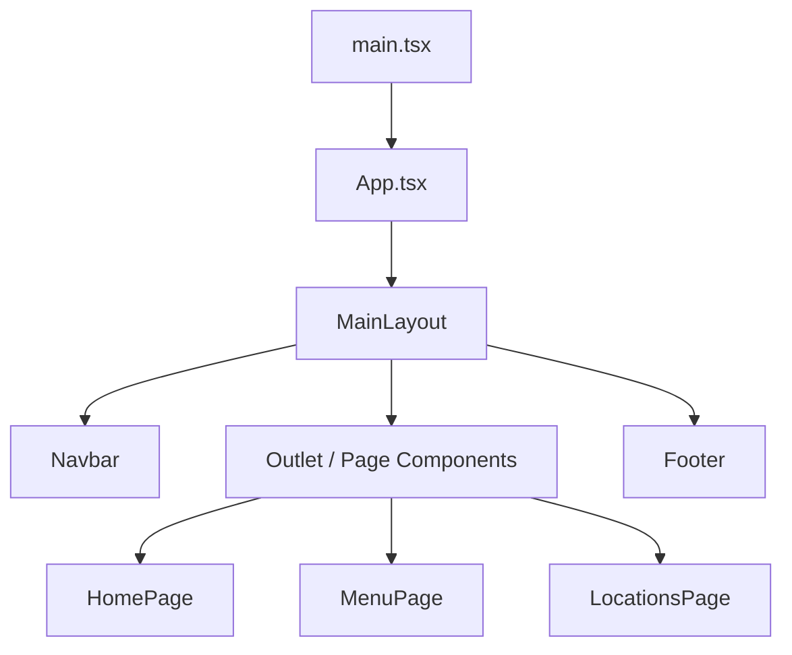
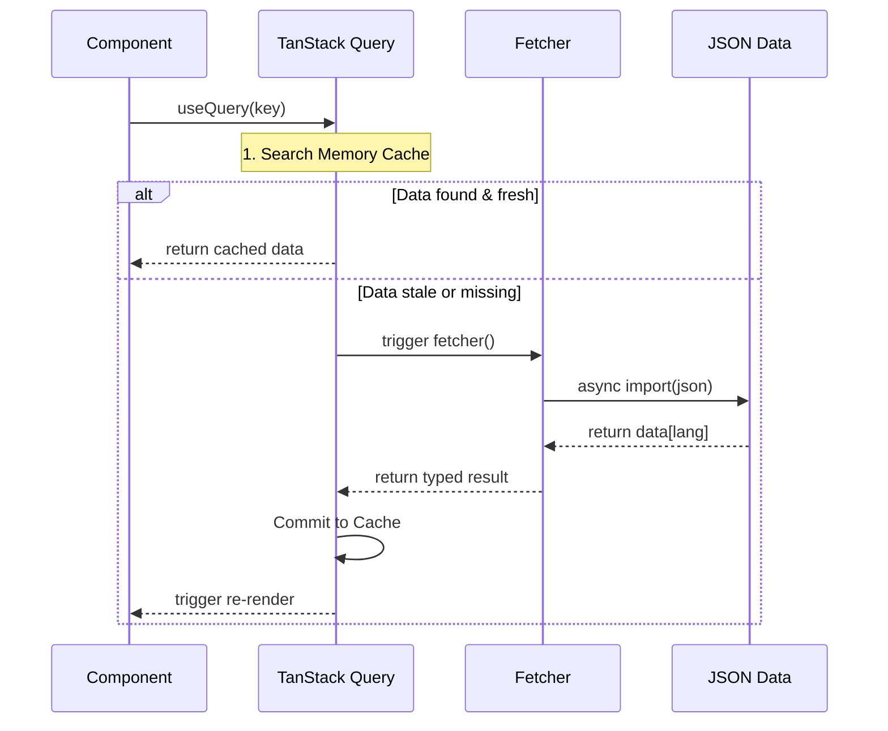

# 🏗️ System Design

Visual flow and application logic diagrams.

## Application Hierarchy

## Data Lifecycle Flow

## Route Resolution Logic
1. **Request:** User hits `/en/menu`.
2. **Layout:** `MainLayout` detects `lang` change, triggers `i18next.changeLanguage()`.
3. **Pillars:** `document.dir` flips to `ltr`; CSS logical properties adjust layout.
4. **Content:** `MenuPage` fetches data via `useQuery(['menu'])`.
5. **SEO:** `react-helmet-async` injects `<title>Starbucks Menu</title>`.

---
*For folder organization, see [STRUCTURE.md](STRUCTURE.md).*
