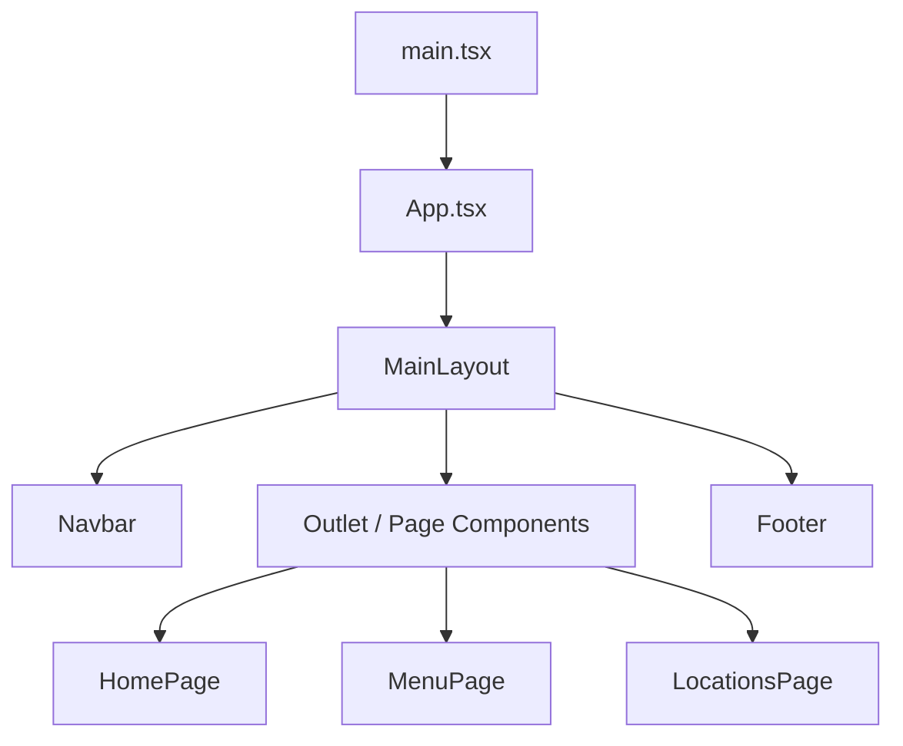
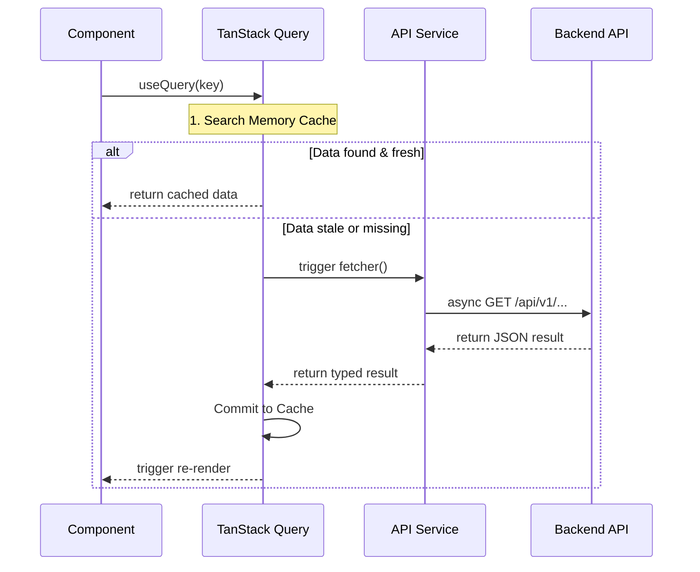

<div align="center">

# 🏗️ Architecture & Design

**Detailed technical overview of the Starbucks Egypt engineering patterns, system design, and project structure.**

</div>

---

## 1. State Management Strategy

The application employs a **Dual-State** architecture to separate local UI interactions from persistent server data:

### Server State (TanStack Query)
- **Source of Truth:** Asynchronous data from the Backend API.
- **Logic:** Custom hooks in `src/hooks/queries/` wrap `useQuery` to provide typed, cached data.
- **Caching:** We use a stale-while-revalidate strategy. Static content (About, Sustainability) is cached for 24h, while dynamic content (Menu) is cached for 1h.

### UI State (Context & Hooks)
- **Navigation:** Managed via `useNavigation` to sync route changes with UI elements.
- **Theme:** `useTheme` manages the Light/Dark mode preference in `localStorage`.
- **Language:** `i18next` context handles the global `ar`/`en` toggle.
- **Global State:** `Zustand` is used for client-side state like shopping cart and user preferences.

---

## 2. The "Bilingual Data" Pattern

To avoid duplicated logic for Arabic and English, all data follows a **Normalized Bilingual Schema**:

```typescript
interface BilingualData<T> {
  en: T;
  ar: T;
}
```

- **Fetching:** Component requests data via `useQuery`.
- **Resolution:** The UI resolves content using `data[i18n.language]`.
- **Fallback:** If a language key is missing, the system defaults to English to prevent blank screens.

---

## 3. System Design Diagrams

### Application Hierarchy


### Data Lifecycle Flow


---

## 4. Project Structure

### Frontend Directory Tree
```text
src/
├── assets/              # Static assets (images, logos)
├── components/          # UI components
│   ├── accessibility/   # ARIA and screen reader helpers
│   ├── layout/          # Shell components (Navbar, Footer, MainLayout)
│   ├── sections/        # Domain-specific UI sections
│   ├── skeletons/       # Content placeholders
│   └── ui/              # Atomic primitives (Buttons, Inputs, etc.)
├── constants/           # Global app constants
├── contexts/            # React Contexts (Theme, Auth, Language)
├── hooks/               # Custom hooks & TanStack queries
├── lib/                 # Core configs (i18n, QueryClient)
├── pages/               # Route-level page components
├── services/            # API services and configurations
└── types/               # TypeScript interfaces
```

### Backend Architecture
The backend follows **Clean Architecture** with four distinct layers:
1. **Domain:** Enterprise logic and entities.
2. **Application:** Business logic, CQRS (MediatR), and DTOs.
3. **Infrastructure:** Data access (EF Core), Redis, and external services.
4. **API:** Entry point, controllers, and middleware.

---

<div align="center">
  <b>Related Documents</b> <br/>
  <a href="DEVELOPMENT.md">DEVELOPMENT.md</a> &nbsp;&bull;&nbsp; <a href="FEATURES.md">FEATURES.md</a>
</div>
